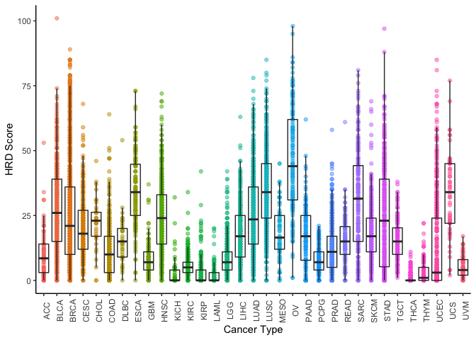
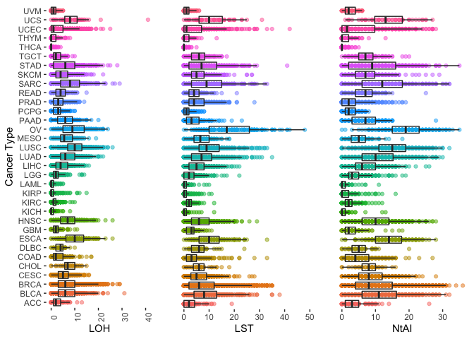

Homologous Recombination Deficiency
================

“We calculated HRD scores following previous published 3 components of
HRD/genome scarring scores: HRD-LOH (Abkevich et al., 2012), LST (Popova
et al., 2012), NtAI (Birkbak et al., 2012) and the implementation of a
sum of the three (Marquard et al., 2015).” - Knijnenburg et al

Scores downloaded from :
<https://gdc.cancer.gov/about-data/publications/PanCan-DDR-2018> on June
6, 2019 10:12 AM. They were then combined with PanCancer Atlas clinical
data available from :
<https://github.com/GerkeLab/TCGAclinical/blob/master/data/clinical_survival_pancancer_atlas.RData>.
Gene expression data can be downloaded from :
<https://gdc.cancer.gov/about-data/publications/PanCan-CellOfOrigin>

<!-- -->

<!-- -->

# HRD Scores

The HRD scores as derived from Knijnenburg et al are available for 9125
samples across 33 cancer types. 8602 samples are from primary solid
tumor, 162 from primary blood derived cancer - peripheral blood and 361
from mets. All 162 primary blood derived cancer - peripheral blood
samples came from LAML and all 361 mets cases were from SKCM. Each
patient only had one sample with HRD calculated (even if they supplied
multiple tissue samples). HRD scores ranged from 1 to 101, with a median
value of 14 and varied by cancer type (see above image).

HRD scores are missing for 239 samples in the original data (Knijnenburg
et al). Of the 9125 patients, 20 are missing clinical data from the
PanCancer Atlas. From the PanCancer Atlas 2060 samples were not included
in the original HRD calculations.

9118 of the 9125 samples also have gene expression data from the same
tissue available.

**Created files:**

  - DDRscores.RData and DDRscores.txt - combined score information from
    Knijnenburg in a usable format
  - clinical\_and\_hrd.RData and clinical\_and\_hrd.txt - PanCancer
    clinical data with scores information (9105 overlapping patients
    only)
  - gene\_and\_hrd.RData and gene\_and\_hrd.txt - PanCancer gene
    expression data with scores information (9118 overlapping patients
    only). These files are too large to place on GitHub and are
    available on request.

**Abbreviations:**

  - HRD - homologous recombination deficiency
  - LOH - loss of heterozygosity
  - LST - large-scale state transitions
  - NtAI - number of subchromosomal regions with allelic imbalance
    extending to the telomere
